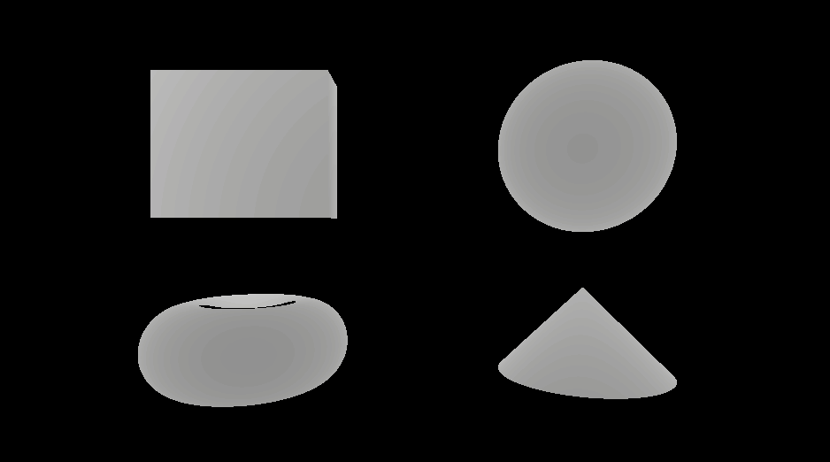
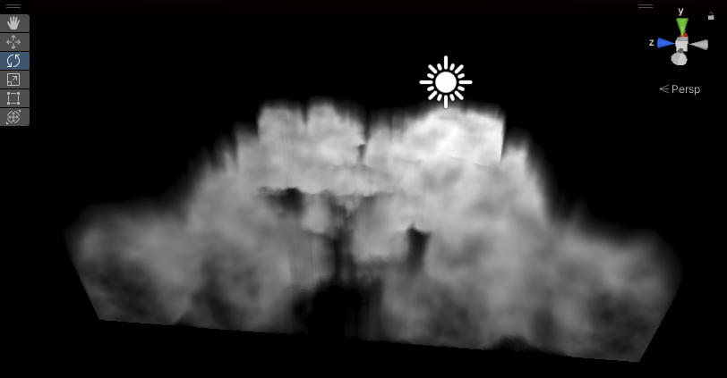
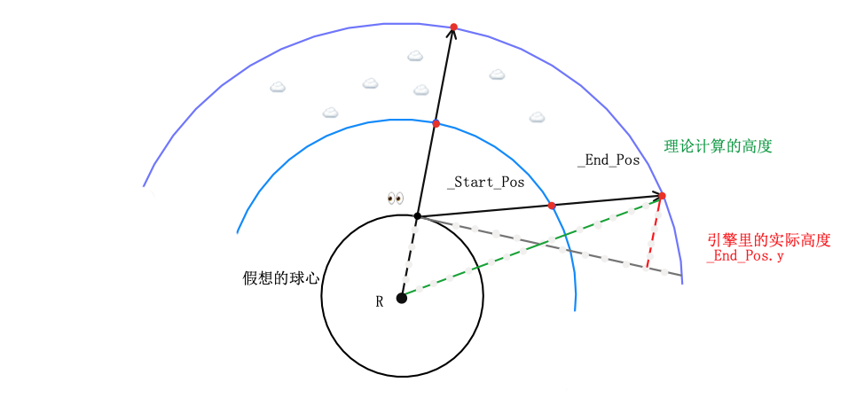
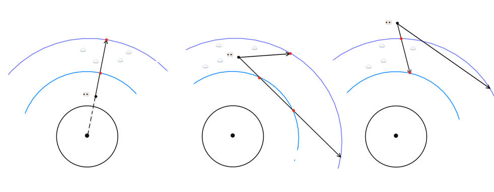
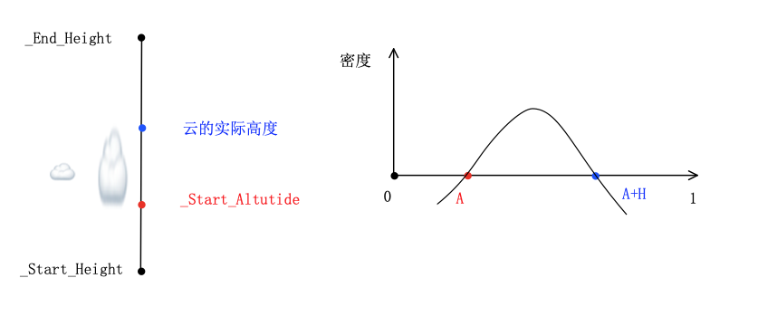

## 前置知识

📍实时生成几何体： ray tracing

📍基于屏幕空间后处理：光栅化rasterization

### Ray March

原理类似光线追踪，从摄像机向场景发射**射线**，每次沿射线方向步进**一定**距离。

* 作为后处理“画”在铺屏四边形上：
   	1.	射线起点：原点/相机空间；
   	2.	射线方向：从（原点）向近平面发送射线，再转换到计算所在的空间，一般从相机（右手系）转换到世界空间（左手系）。	

* 画在物体上（比如一个立方体）：
  1. 射线起点：相机世界坐标（或和物体包围盒求交点）；
  2. 射线方向：像素世界坐标。【但是不是和近平面对齐，可能锯齿会更多】
* （外部脚本输入，可以可视化）

相比于固定步长，更好的策略是每次尽可能多得向前步进，如果可以知道距离当前位置最近点的距离，那么在这个距离范围内前进必然是”安全的“。一种实现方法是使用SDFs (Signed Distance Functions)，输入一个点的位置，返回这个点在场景中距离最近的点的距离。 

如简单的球体计算公式：

```c
            // p:pos-圆心
            float sdSphere(float3 p, float radius)
            {
                return length(p) - radius;
            }
```


<center>Sphere Marching</center>

 

这样就可以在场景中画出一个最简单的球体，增加其他图形的SDFs公式，可以随意组合：

```c
///Cloud/RayMarching.shader
```



几何体是以公式的方式给出，所以可以直接用有限差分法计算表面法线，

和Ray Tracing不同，Ray march一般用来计算简单图元，计算法线和光照，运用噪音甚至可以利用基本图元渲染出复杂而逼真的渲染效果。感兴趣可以看下面👇的参考资料，不过作为体积云的前置知识到这一步也足够了，Let`s move on😊～


> 新手村教学：
>
> https://michaelwalczyk.com/blog-ray-marching.html
>
> 常见图元的距离场函数：
>
> https://www.iquilezles.org/www/articles/distfunctions/distfunctions.htm
>
> 🍃🐌：
>
> https://www.iquilezles.org/www/articles/raymarchingdf/raymarchingdf.htm
>
> 生成地形和森林：
>
> https://www.iquilezles.org/www/articles/terrainmarching/terrainmarching.htm
>
> https://iquilezles.org/www/articles/fbm/fbm.htm


### 物理光

#### 现象

光在介质（participating media, particle with varying radius）中传播会发生：

* 散射（Scattering）
  * 内散射（In-Scattering）：增强（光源的贡献）
  * 外散射（Out-Scattering）：衰减

* 吸收（Absorption）

* 透射（Transmittance）

* 自发光（Emission）：火焰🔥

  

#### 物理模型

* Beer-Lambert Law：计算穿过媒介的透射光比例

* 瑞利散射（Rayleigh Scattering)：

  * 颗粒直径**远小于**波长时发生的散射散射；
  * 散射小分子如空气粒子，（散射强度和波长成反比，蓝紫光波长<红光，散射更多，这是天空呈现蓝色的原因）；
  * 吸收忽略不计；

* 米氏散射（Mie Scattering）：

  * 颗粒直径比波长**约为1**时发生的散射；
  * 散射大分子如气溶胶（aerosols，存在于低海拔的地球大气附近）、灰尘、烟雾；太阳附近的光晕（halo）
  * 吸收性更强；

* 几何散射（Geometric scattering）：几何光学散射

  * 颗粒直径**远大于**波长

  * 光在粒子中发生反射和折射，如彩虹🌈

    


#### 用于实时渲染的物理模型([源](https://media.contentapi.ea.com/content/dam/eacom/frostbite/files/s2016-pbs-frostbite-sky-clouds-new.pdf))


$$
L_i(x_i, ω_i) = T_r(x, x_s)L(x_s, ω_i) +\int_{t=0}^{S}

T_r(x, x_t)Lscat(x_t, ω_i)σ_sdt
$$

* 透射（Transmittance）：$\sigma_t（x）$ ：x点的衰减（extinction）系数，$\Delta x=x_b-x_a$：步进深度/走过的距离，$\sigma_t \Delta$x：光学深度（optical depth）；衰减系数越大、步进的深度越大，透射的光越少；
  $$
  T_r(x_a, x_b)=exp(-\int_{x=x_a}^{x_b}\sigma_t(x)dt)
  $$

* 内散射（In-Scattering）:
  $$
  Lscat(x,ω_i)= 􏰕 \Sigma_{i=0}^{lights} p(ω_i,L)Vis(x,L)L_i(x,L)
  $$

  1. 阴影：

    - 可见性方程：采样ShadowMap，返回0或1代表是否在阴影中：

  $$
    V is(x, L) = shadowMap(x, L) ∗ volumetricShadow(x, L)
  $$

    * 体积阴影：媒介的Self-Shadow，采样点x到光的距离，映射到[0,1]之间；需要第二次向光源步进；
      $$
      volumetricShadow(x, L) = T r(x, xL)
      $$

  2. Albedo:

    * $\sigma_a$：吸收系数、$\sigma_s$：散射系数；

    * 单位$m^{-1}$，与波长有关，所以用RGB分量表示；

    * 可见光：red (680nm), green (550nm) and blue (440nm) light spectrum.

    * 媒介自身的颜色，接近1的散射多，如白色的云和空气；接近0的媒介对光的吸收更多，如深色的雾霾；
      $$
      \sigma_t=(\sigma_s+\sigma_a)
      $$

      $$
      \rho=\sigma_s/(\sigma_s+\sigma_a)
      $$

      

  3. 相位方程（Phase function）:r：粒子半径，$\lambda$波长；粒子半径的分布会影响媒介中光散射的方向；
  $$
    x =\frac{2πr}{\lambda}
  $$
    ​	x ≪ 1 : 瑞利散射

    ​	x ≈ 1 : 米氏散射

    ​	x ≫ 1 : 几何散射

    

    - 各向同性散射（Isotropic Scattering）： 散射方向和**入射光方向**无关；θ :入射光方向和散射方向的夹角
      $$
      p(θ)=\frac{1}{4\pi}
      $$

    - 各向异性散射/非对称散射（Asymmetric Scattering）：

      a.	瑞利散射的相位方程：
      $$
      p(θ)=\frac{3}{16\pi}(1+cos^2\theta)
      $$
      b.	米氏散射的相位方程：

      - g：(0,1)之间，负数散射背向光多，g用来控制向前还是向后散射

  $$
  p(θ,g)=\frac{1-g^2}{4\pi(1+g^2-2gcos\theta)^{1.5}}
  $$

虽然看上去很复杂（实际也确实很复杂），体积光、雾、云、大气都是基于以上公式（本质都是一种传播媒介），只是参数和光照计算有所不同。

小声说句公式写作积分，但是可以读作黎曼和，这样可能好理解一点，总之下面要做的事是把公式"翻译"成程序。


## 


## Volumetric Light/Fog

> 其他实现：
>
> * Billboard
>
> * Post-processs

### Base

【世界空间】

从RayMarch的框架开始，从相机位置“看向”像素（世界坐标），每一步根据公式计算光线衰减、散射、透射和阴影，

这里类似后处理直接画在铺屏四边形。

【 downscaled texture.】


```c
///Cloud/VolumetricLight.shader
```


<center>（伪装成点光源的平行光</center>

### 噪音+模糊

步进次数多开销巨大，减少步进次数又会带来明显的层次感即走样。一个优化方法是增加采样的随机性，而随机性带来的噪点则用模糊去减弱。


可以搭一个森林的场景然后应用一下：

或者用在室内：


体积雾，$\sigma_t（x）$为常量，也没有self-shadow


【其他光源】


> 体积光：
>
> https://www.shadertoy.com/view/XlBSRz
>
> http://www.alexandre-pestana.com/volumetric-lights/
>
> 体积雾🌫️🌁：
>
> http://advances.realtimerendering.com/s2014/wronski/bwronski_volumetric_fog_siggraph2014.pdf
>
> 径向模糊体积光：
>
> https://developer.nvidia.com/gpugems/gpugems3/part-ii-light-and-shadows/chapter-13-volumetric-light-scattering-post-process

## Atmosphere

上文的体积光是不考虑传播介质的，大气包裹在地球周围，密度随高度指数下降

https://www.scratchapixel.com/lessons/procedural-generation-virtual-worlds/simulating-sky

## Volumetric Cloud

雾：均匀介质(homogeneous media)，各方密度相等
云：非均匀介质（heterogeneous media），密度采样3d纹理得来

### Ray March的起点和终点

体积云在体积光的框架上继续，可以画在铺屏四边形上，也可以画在立方体上。后者需要和立方体包围盒求交点；

#### 立方体云

关于求交点，一种方法是将点转换到立方体空间，将问题转换成射线和轴对齐包围盒求交问题。



<center>飘在空中很假（）</center>

#### 球形大气层

本质上是射线和球体求交点问题，已知两者表达式的前提下，直接联立解方程即可。

在相机位置沿正y方向、反向延长一定距离可以得到一个“假想”的地球球心。在球形大气层模型下，实际计算高度差时应计算距离球心的距离，而非y方向的坐标值。顺便如果是将视线在正y方向的投影值视作高度值，得到的是“平铺”的大气层。



<center>球形大气模型</center>

分类讨论相机和云的位置关系：




### 形态

#### 密度

【3d噪音生成】

体积光和雾的$\sigma_t（x）$ 是一个给定的常量，体积云的$\sigma_t（x）$ 是变化的，一般从3D纹理中采样得来，即密度；

#### 天气贴图：

RGB通道分别对应：

- 云的分布：用xz世界坐标采样；

- 云自身的高度；

- 云所在的海拔；Height Gradient

  云的整体形态随高度和海拔呈抛物线形变化，中间敦实而底部和顶端的云层自然消减（erode），



### 光照

#### Sun Light Scattering

#### Atmosphere Scattering

用高度对天空盒纹理采样

> 🐇☁️：
>
> https://www.shadertoy.com/view/MdlyDs
>
> https://shaderbits.com/blog/creating-volumetric-ray-marcher