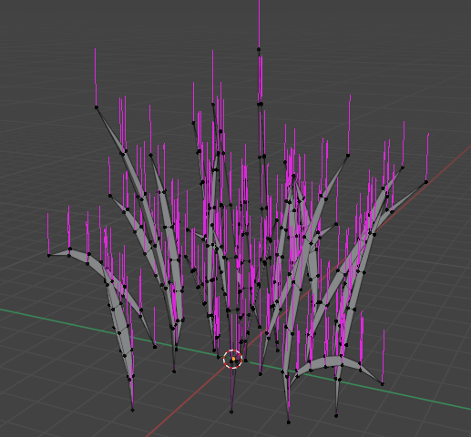
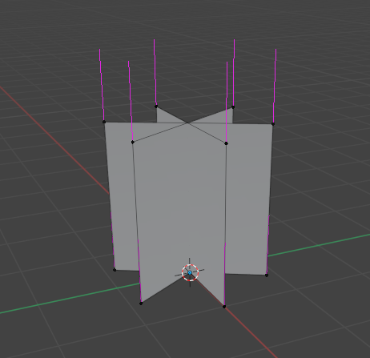
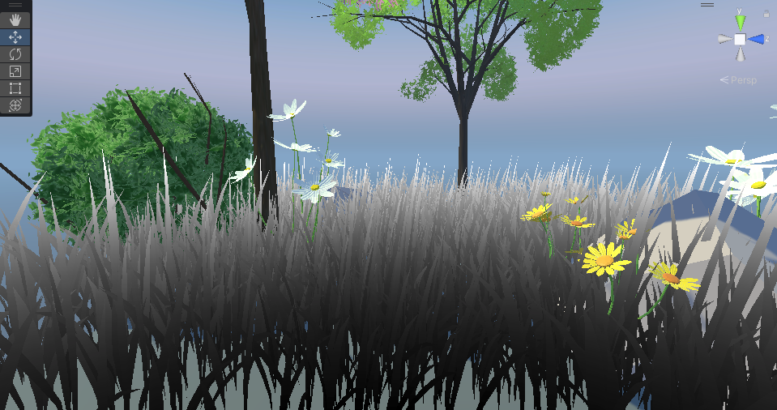
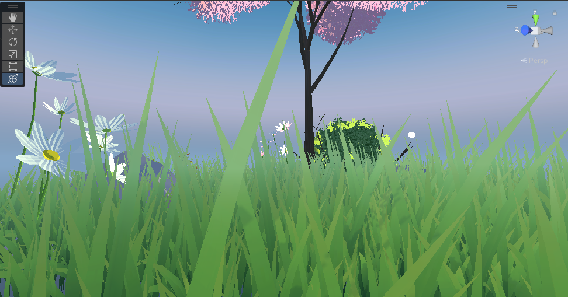
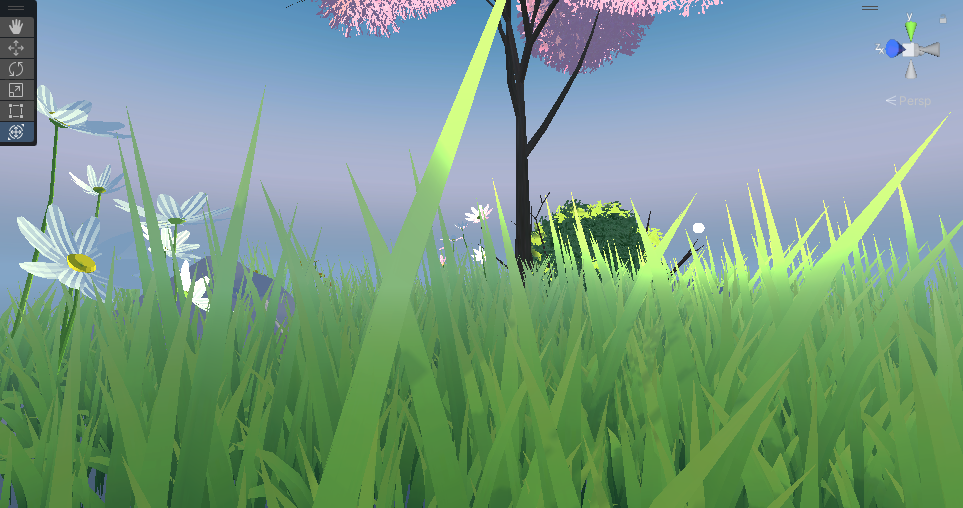
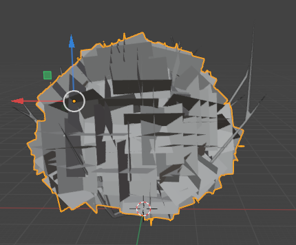
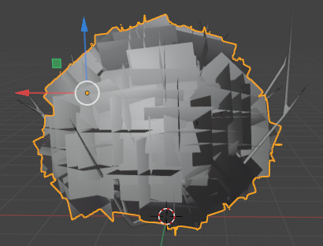

## 草

### 草的建模：

* 单颗草，修改法线方向为正z



* 插片草，3个quard插片



 都需要在建模时修改法线方向为正y（地形法线）或者计算着色时修改法线。插片草从上方看会明显出戏，可以和单科草组成LOD组。


测试用的[贴图草](https://learnopengl-cn.github.io/img/04/03/grass.png)。  


### 混合方式

着色需要关掉背面裁剪；

* Alpha Blend ：需要对所有植被对象排序，有额外的开销；树丛无法对自身排序；

* Alpha Test : 开启提前深度测试效率更高，但是会有锯齿

【抗锯齿可以在pass里开启msaa，？但是没有什么用】


### GPU instance

植被等大量出现、单性质变化有限的物体，可以用GPU实例化优化。简单来说一个Mesh，在GPU端重复绘制多次，从而可以减少DrawCall，提高效率。

最多1023个 instances，所以一块草地生成草的上限是1k。


### 动画

设置一张全局Flow Map纹理，可以应用到所有植被上。

先简单尝试一下，顶点运动动画，可以用uv的v分量做为权重来控制运动幅度，实现草根不动，草叶越往上幅度越大的效果：

```c
 v.vertex.xyz+=_windDir*sin(_Time.y*_windSpeed)*pow(v.uv.y,2)*_windStrength;
```


给每一棵草的运动增加随机性，可以让整体效果看得过去，但是如果要整体视觉上有流动感，需要每棵草的运动和它相对于整块草地的位置有关，所以仅仅这样做是不够的。流体效果的实现一般是从distorted map里采样，[这里](https://roystan.net/media/tutorials/WaterDistortion.png)水波的实现就是在像素着色器根据采样值做uv偏移。

可以用草的世界xz坐标采样，这样一块草地整体上来看运动就会呈现波浪状；

⚠️顶点着色器采样纹理需要tex2dlod指定mipmap等级，否则可能会报错。

```c

```


<center>好耶～		


### 着色

草地使用的是简单着色模型。草叶本身的固有色自顶向下渐变，模拟ao的感觉（根部更密集）。

动画不改变法线方向（正y），镜面高光效果不好；

#### 菲涅尔反射

草地整体的边缘光：



#### 次表面散射：





 

## 🌲

树丛和草丛制作逻辑相似。树丛的建模需要置换法线，来模拟球体：




<center>置换法线前，着色有比较明显的出戏感（不是
</center>




<center>法线置换成球的法线后</center>


> 面片草：
>
> https://developer.nvidia.com/gpugems/gpugems/part-i-natural-effects/chapter-7-rendering-countless-blades-waving-grass
>
> 几何着色器草：
>
> https://roystan.net/articles/grass-shader.html
>
> https://medium.com/dotcrossdot/compute-shaders-grass-rendering-6916a9dd008e
>
> 几何+计算着色器草：
>
> https://www.youtube.com/watch?v=0H1FVOphmIo&list=PLEwYhelKHmigG2uo6zW-LNKtmYUHpC5z4&index=1
>
>  
>
> GPU instance:
>
> https://catlikecoding.com/unity/tutorials/custom-srp/draw-calls/#2.3
>
> https://docs.unity3d.com/cn/current/Manual/GPUInstancing.html