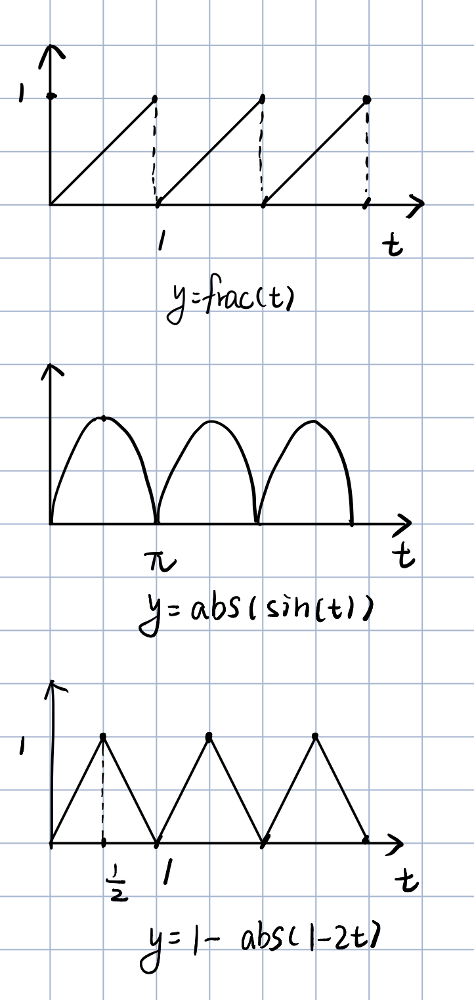
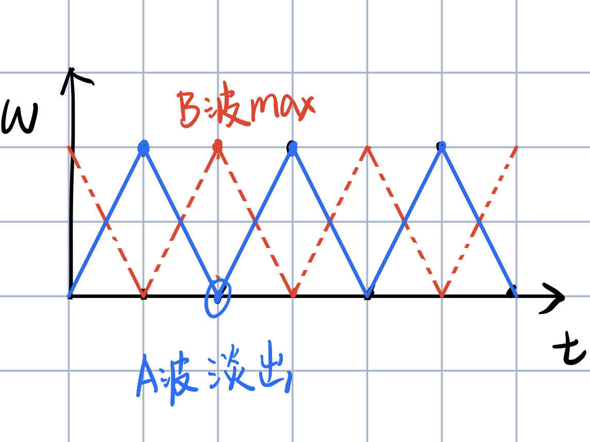
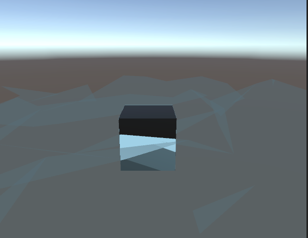
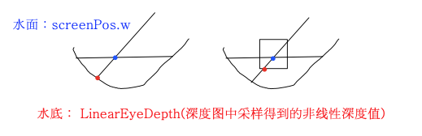
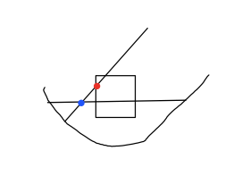

# Stylished Water

## Animation

### Flow

📍uv偏移动画

uv+_Time.y：简单地沿对角线方向运动；

采样flow map改变uv偏移方向，[这里](https://catlikecoding.com/unity/tutorials/flow/texture-distortion/seamless-looping/flowmap.png)，RG通道分别存放UV方向信息 It contains multiple clockwise and counterclockwise rotating flows, without any sources or sinks。

纹理的采样是周期函数



简单的周期函数，frac(_Time.y)，截断小数。

问题也很明显，1到0的突变使得视觉上不连续，其他的周期函数比如abs(sin)也无法平滑过度（来回震荡~~反复横跳~~）。周期性是无法消除的，但是可以通过设置一个权重“**隐藏**”这种不连续。

权重函数取三角波就可1-|1-2t|，因为三角函数效果未必更好，但计算量更大；隐藏了不连续，但同时带来了新问题，淡出时会变黑（归0），依然显得突兀；

可以引入一个时间偏移量，淡出时仍然会变黑，但是随机性增加了；再引入另一个波，一个淡入时另一个淡出，最终可以消除掉黑色。[这里](https://catlikecoding.com/unity/tutorials/flow/texture-distortion/seamless-looping/flowmap.png)是一张flow map,rg通道为uv偏移方向，a通道为时间噪音。



```c
// Shader "Costumn/Water"           
float3 gatFlowUVW (float2 uv, bool flowB) { 
                float phaseOffset = flowB ? 0.5 : 0;
                float2 jump = float2(_UJump, _VJump);
                float3 uvw;
                
                float4 color = SAMPLE_TEXTURE2D(_FlowMap, sampler_FlowMap, uv)* _Strength;
                float2 dir = color.rg * 2 - 1;
                float timeOffset = color.a;

                float time=frac((_Time.y * _Speed + timeOffset)  + phaseOffset);
                uvw.xy =uv - dir * time + phaseOffset;  
                uvw.z = 1 - abs(1 - 2 * time);
                return uvw;
            }
...
  float3 uvwA=gatFlowUVW(input.uv,true);
                float3 uvwB=gatFlowUVW(input.uv,false);
                float4 albedo=SAMPLE_TEXTURE2D(_MainTex,sampler_MainTex,uvwA.xy)* uvwA.z;
                float4 albedo2=SAMPLE_TEXTURE2D(_MainTex,sampler_MainTex,uvwB.xy)* uvwB.z;
...
```

圈圈状还是比较明显，两个波的周期性

We could simply slide the UV coordinates based on time, but that would cause the whole animation to slide, introducing a directional bias.We can avoid visual sliding by keeping the UV offset constant during each phase, and jumping to a new offset between phases. 

```c
                uvw.xy += ((_Time.y * _Speed + timeOffset)  - time) * jump;                

```

【锯齿TAA?还是DTX1压缩格式纹理】


<center>不动的时候水的动画还挺真的</center>

### Wave

📍顶点偏移动画

再另外一个shader里简单尝试了一下sin海浪



<center>除了有点假的地方都挺真的</center>


## Water Surface/Texturing

只计算了p b r的菲涅尔项

【？视差贴图比法线贴图好，高低参差vs方向】


## Underwater & Fog

光在【均匀介质】（密度相同，可以让光束直线穿射过的 ）中传播被吸收的现象，



<center>原理是水面（透明层）不写入深度缓存。</center>

```c

```


## Reflection

水面比较适合平面反射，?直接作为间接光源。


## Refraction

【caustics 】

折射和反射一样也有局部算法、全局算法和屏幕空间算法。

这里是屏幕空间算法，只是视觉上的近似，并不符合物理规律：

URP里已经没有grabPass，需要开启color texture，_CameraOpaqueTexture透明物体渲染完成之后的截图。采样时，根据法线进行纹理偏移，水波越高的地方，偏移越大。折射会随着法线运动。

可以注意到物体附近、水面上也会有不应该出现的偏移。

深度小于0时，偏移量取0，重新采样。



<center>边缘会有采样精度问题</center>

```c

```


## Foam

基于深度差的白沫

原理同上：有物体存在时（包括接近岸边时），水面、水底的深度差会变小，这样的地方会存在白沫。

```c
		// 同上，depth是水面到水底的距离        
		half4 foamMask =1 - saturate(_FoamThickness* depth);
...

```

白沫的形态和动画可以采样一张噪音图。

【怎么消除纵深感】


## Reference

> Outline:
>
> https://github.com/QianMo/Game-Programmer-Study-Notes/tree/master/Content/%E7%9C%9F%E5%AE%9E%E6%84%9F%E6%B0%B4%E4%BD%93%E6%B8%B2%E6%9F%93%E6%8A%80%E6%9C%AF%E6%80%BB%E7%BB%93
>
> 不要用switch玩黑旗，一点水花都看不见：
>
> https://www.fxguide.com/fxfeatured/assassins-creed-iii-the-tech-behind-or-beneath-the-action/
>
> 有教无类当代孔子：
>
> https://catlikecoding.com/unity/tutorials/flow/
>
> 卡通水：
>
> https://roystan.net/articles/toon-water.html
>
> https://lindenreidblog.com/2017/12/15/simple-water-shader-in-unity/
>
> 
>
> ...：
>
> https://learnopengl-cn.github.io/07%20PBR/01%20Theory/

