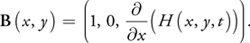
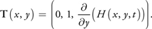
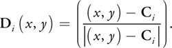
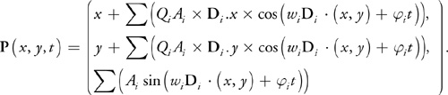
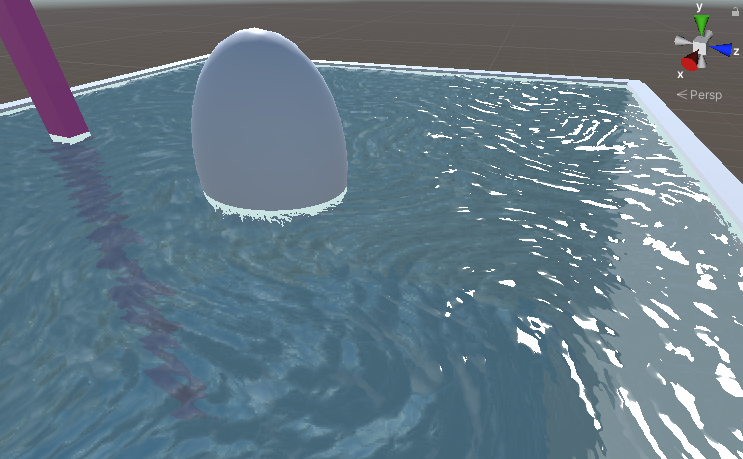

# Stylished Water

## Animation

### Flow

📍uv偏移动画

uv+_Time.y：简单地沿对角线方向运动；

采样flow map改变uv偏移方向，[这里](https://catlikecoding.com/unity/tutorials/flow/texture-distortion/seamless-looping/flowmap.png)，RG通道分别存放UV方向信息 It contains multiple clockwise and counterclockwise rotating flows, without any sources or sinks。

纹理的采样是周期函数


简单的周期函数，frac(_Time.y)，截断小数。

问题也很明显，1到0的突变使得视觉上不连续，其他的周期函数比如abs(sin)也无法平滑过度（来回震荡~~反复横跳~~）。周期性是无法消除的，但是可以通过设置一个权重“**隐藏**”这种不连续。

权重函数取三角波就可1-|1-2t|，因为三角函数效果未必更好，但计算量更大；隐藏了不连续，但同时带来了新问题，淡出时会变黑（归0），依然显得突兀；

可以引入一个时间偏移量，淡出时仍然会变黑，但是随机性增加了；再引入另一个波，一个淡入时另一个淡出，最终可以消除掉黑色。[这里](https://catlikecoding.com/unity/tutorials/flow/texture-distortion/seamless-looping/flowmap.png)是一张flow map,rg通道为uv偏移方向，a通道为时间噪音。


```c
// Shader "Costumn/Water"           
float3 gatFlowUVW (float2 uv, bool flowB) { 
                float phaseOffset = flowB ? 0.5 : 0;
                float2 jump = float2(_UJump, _VJump);
                float3 uvw;
                
                float4 color = SAMPLE_TEXTURE2D(_FlowMap, sampler_FlowMap, uv)* _Strength;
                float2 dir = color.rg * 2 - 1;
                float timeOffset = color.a;

                float time=frac((_Time.y * _Speed + timeOffset)  + phaseOffset);
                uvw.xy =uv - dir * time + phaseOffset;  
                uvw.z = 1 - abs(1 - 2 * time);
                return uvw;
            }
...
  float3 uvwA=gatFlowUVW(input.uv,true);
                float3 uvwB=gatFlowUVW(input.uv,false);
                float4 albedo=SAMPLE_TEXTURE2D(_MainTex,sampler_MainTex,uvwA.xy)* uvwA.z;
                float4 albedo2=SAMPLE_TEXTURE2D(_MainTex,sampler_MainTex,uvwB.xy)* uvwB.z;
...
```

圈圈状还是比较明显，两个波的周期性

We could simply slide the UV coordinates based on time, but that would cause the whole animation to slide, introducing a directional bias.We can avoid visual sliding by keeping the UV offset constant during each phase, and jumping to a new offset between phases. 

```c
                uvw.xy += ((_Time.y * _Speed + timeOffset)  - time) * jump;                

```

【锯齿TAA?还是DTX1压缩格式纹理】


水的着色稍后再谈，先用菲涅尔项简单计算一下着色，环境光用反射向量采样天空盒。

【？视差贴图比法线贴图好，高低参差vs方向】


<center>不动的时候水的动画还挺真的</center>

两个圆波叠加，

有点地下泉涌出的感觉，适合小面积的水：

比如做个阳光灿烂的小水池：

【🚩】


【单向流动】

### Wave🌊

📍顶点偏移动画

大面积的水面会被风吹起海浪，这时候纹理动画就不够了，需要引入顶点动画。

再另外一个shader里简单尝试了一下sin海浪


<center>除了有点假的地方都挺真的</center>

#### 三角函数波：[源](https://developer.nvidia.com/gpugems/gpugems/part-i-natural-effects/chapter-1-effective-water-simulation-physical-models)

$$
W_i(x,y,t)=A_i*sin(D_i*(x,y)*w_i+t*\varphi_i)
$$

* L：波长，w：频率，w=2/L

  * $w=\sqrt{g*\frac{2\pi}{L}}$  ，g：重力加速度

* A：振幅

* S：波速

* $\varphi$：相位，$\varphi$=S*2/L

* D：运动方向

  

#### 法线：

对**x、z**分别求导，两者叉乘即得法线。

？方向






```c
                float W = 2 * PI / L;
                //+：向内运动，-：向外运动
                float P = W * (i.positionOS.x - S * _Time.y);

                i.positionOS.y = A * sin(P);
                
                // T:对(x, y=f(x), z) x求导
                float3 Tangent = normalize(float3(1, W * A * cos(P), 0));
                // B:对z求导
                float3 Bitangent = float3(0, 0, 1);
								o.normal=normalize(cross(Bitangent, Tangent));
```


#### 方向：

##### 方向波：

输入一个方向向量，或者在给定范围内随机产生

```c
								float2 D =  normalize(_Direction);
								...
                float P = W * (dot(D,i.positionOS.xz) - S * _Time.y);								
								// T:对(x, y=f(Dx+Dz), z) x求导
                float3 Tangent = normalize(float3(1, D.x * W * A * cos(P), 0));
                // B:对z求导
                float3 Bitangent = float3(0, D.y * W * A * cos(P), 1);
```

<video src="notes/water/方向波.mp4"></video>

<center>给了个(3,2)的方向</center>

##### 圆形波：




```c
            void CircleWave(out float2 D,   float2 xz)
            {
                #define cicle float2(0, 0)
                D = (xz - cicle) / (max(0.01, length(xz - cicle)));
            }
						
```

<video src="notes/water/圆形波.mp4"></video>

<center>Ripple</center>

#### Gerstner Waves

相比于三角波圆润平均，G波更尖锐陡峭。



用Steepness代替振幅

```c
								float A = _Steepness / W;								

								i.positionOS.x += A * D.x * cos(P);
                i.positionOS.y = A * sin(P);
                i.positionOS.z += A * D.y * cos(P);

                // T:对(x+Dxcos(x), y=sin(Dx+Dz),  z+Dzcos(x)) x求导
                float3 Tangent = normalize(float3(1 - D.x * D.x * W * A * sin(P), D.x * W * A * cos(P), 1 - D.x * D.y * sin(P)));
                // B:对z求导
                float3 Bitangent = float3(-D.x * D.y * sin(P), D.y * W * A * cos(P), 1 - D.x * D.x * W * A * sin(P));
                
```

..

<video src="notes/water/G波.mp4"></video>

#### 叠加：

海浪是多个波叠加的产物：
$$
H(x,y,t)=\Sigma (A_i*sin(D_i*(x,y)*w_i+t*\varphi_i))
$$

#### 

## Rendering

### Surface 

#### Reflection

反射的算法很多，这里使用的是平面反射，?直接作为间接光源。

最终混合颜色是水面颜色*alpha即透明度+水底颜色 * （1-alpha)

### Underwater 

#### Fog

水是半透明物体，需要获取水下画面；URP里已经没有grabPass()方法，需要开启color texture，_CameraOpaqueTexture透明物体渲染完成之后的截图。

光在【均匀介质】（密度相同，可以让光束直线穿射过的 ）中传播被吸收的现象，

换句话说越深的地方能见度越低，


<center>原理是水面（透明层）不写入深度缓存。</center>

```c

```


#### Refraction


折射和反射一样也有局部算法、全局算法和屏幕空间算法。

这里是屏幕空间算法，只是视觉上的近似，并不符合物理规律：

采样时，根据法线进行纹理偏移，水波越高的地方，偏移越大。折射会随着法线运动。

可以注意到物体附近、水面上也会有不应该出现的偏移。

深度小于0时，偏移量取0，重新采样。


<center>边缘会有采样精度问题</center>

```c

```


### Caustics 

焦散

【制作无缝纹理】

采样纹理，制作动画效果；类似uv动画，这里也可以用2个采样叠加

光的衍射（Diffract），分离RGB

### SubSurface Scattering

快速近似次表面散射

混合

```c

```


## Foam

基于深度差的白沫

原理同上：有物体存在时（包括接近岸边时），水面、水底的深度差会变小，这样的地方会存在白沫。

```c
		// 同上，depth是水面到水底的距离        
		half4 foamMask =1 - saturate(_FoamThickness* depth);
...

```

白沫的形态和动画可以采样一张噪音图。

【怎么消除纵深感】



component

隐藏地平线/无限水面/雾效遮挡

接受投影


## Reference

> Outline:
>
> https://github.com/QianMo/Game-Programmer-Study-Notes/tree/master/Content/%E7%9C%9F%E5%AE%9E%E6%84%9F%E6%B0%B4%E4%BD%93%E6%B8%B2%E6%9F%93%E6%8A%80%E6%9C%AF%E6%80%BB%E7%BB%93
>
> 不要用switch玩黑旗，一点水花都看不见：
>
> https://www.fxguide.com/fxfeatured/assassins-creed-iii-the-tech-behind-or-beneath-the-action/
>
> 有教无类当代孔子：
>
> https://catlikecoding.com/unity/tutorials/flow/
>
> 卡通水：
>
> https://roystan.net/articles/toon-water.html
>
> https://lindenreidblog.com/2017/12/15/simple-water-shader-in-unity/
>
> 
>
> ...：
>
> https://learnopengl-cn.github.io/07%20PBR/01%20Theory/

