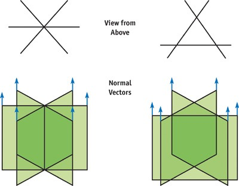

## 贴图

相比单棵草建模，单片Quard或三片组合既能省资源又能近似取得较好的视觉效果。

你可以在这里找到一张测试用的[贴图草](https://learnopengl-cn.github.io/img/04/03/grass.png)。  注意需要关掉背面裁剪，否则环绕时会有视觉bug。




为了光照效果，顶点法线需要设置为正y方向（局部空间），并且世界空间顶点法线需要和地形法线对齐。

拿单片草测试一下，分别是没和地形对齐和对齐的效果：

右边草上边缘处一圈白色锯齿是忘记将纹理环绕方式设置为clamp（一个小坑）

顺便感觉这个思路也可以用来做毛发


#### 混合方式

【？alpha clip 开启提前深度测试 会比alpha blend更高效，但是会有锯齿，抗锯齿可以在pass里开启msaa，但是没有什么用】


#### GPU instance

最多1023个 instances，所以一块草地生成草的上限是1k


## 动画

先简单尝试一下，顶点运动动画，可以用uv的v分量做为权重来控制运动幅度，实现草根不动，草叶越往上幅度越大的效果：

```c
 v.vertex.xyz+=_windDir*sin(_Time.y*_windSpeed)*pow(v.uv.y,2)*_windStrength;
```


给每一棵草的运动增加随机性，可以让整体效果看得过去，但是如果要整体视觉上有流动感，需要每棵草的运动和它相对于整块草地的位置有关，所以仅仅这样做是不够的。流体效果的实现一般是从distorted map里采样，[这里](https://roystan.net/media/tutorials/WaterDistortion.png)水波的实现就是在像素着色器根据采样值做uv偏移。

我的想法是可以用草的世界坐标映射到（0，1）间内做为纹理采样，这样一块草地整体上来看运动就会呈现波浪状；测试场景地在原点，可以先简单除以生草范围尝试一下。这里有个坑，顶点着色器采样纹理需要tex2dlod指定mipmap等级，否则可能会报错。

```c
o.worldPos=TransformObjectToWorld(v.vertex); 
                float2 uv= o.worldPos.xz
/20.f*0.5+0.5;
                float2 windSample=tex2Dlod(_WindTex,float4(uv+_Time.y*_WindSpeed,0,0)).xy*2-1;
                _windDir=float3(windSample,0);  
                v.vertex.xyz+=_windDir *pow(v.uv.y,2)*_WindStrength;
```


<center>好耶～		

实现的话可以在脚本里将生草范围和中心位置一并传递给着色器，在顶点着色器里计算类似viewPort矩阵，但是我拒绝

因为想要实现和草交互，这种情况下每一帧都要重新计算草的位置，所以下面打算用compute shader重写。


## 交互


## 着色


#### 性能优化

lod

抗锯齿

Temporal Anti-Aliazing [ref](https://zhuanlan.zhihu.com/p/138866533)

look down不自然


> 面片草：
>
> https://developer.nvidia.com/gpugems/gpugems/part-i-natural-effects/chapter-7-rendering-countless-blades-waving-grass
>
> 几何着色器草：
>
> https://roystan.net/articles/grass-shader.html
>
> https://medium.com/dotcrossdot/compute-shaders-grass-rendering-6916a9dd008e
>
> 几何+计算着色器草：
>
> https://www.youtube.com/watch?v=0H1FVOphmIo&list=PLEwYhelKHmigG2uo6zW-LNKtmYUHpC5z4&index=1
>
>  
>
> GPU instance:
>
> https://catlikecoding.com/unity/tutorials/custom-srp/draw-calls/#2.3
>
> https://docs.unity3d.com/cn/current/Manual/GPUInstancing.html