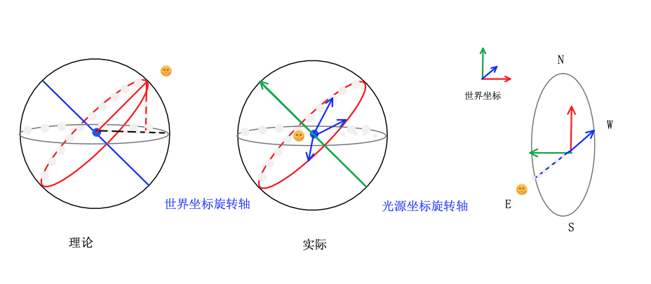
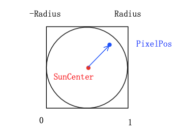
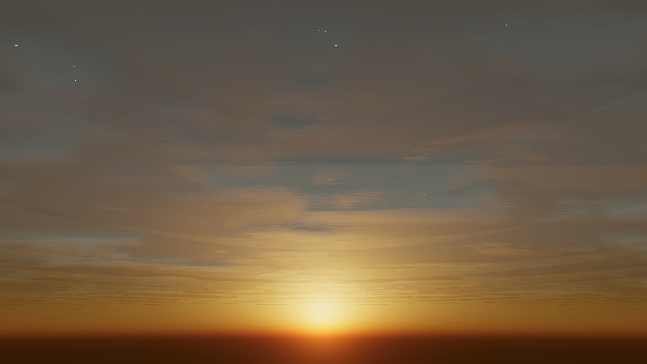

# Dynamic Sky

## 1.底色

Procedural Skybox

天空盒原理

天空盒是“包围”在相机外部、即中心在原点的单位立方体，不会随着相机位移而改变位置，营造出世界无限延伸的错觉。渲染天空盒时，是用单位立方体的局部顶点坐标进行纹理采样，所以顶点着色器需要像片元着色器传递局部坐标，插值后再经过归一化就可以作为纹理坐标。

将3维球体上的坐标映射到一张2D纹理，该纹理即等距柱状投影图(Equi-rectangular Projection  ?Panorama)，基本思路是用相同数量的采样点保存每条纬线上的数据，水平比两极精确。等距柱状投影图、球体、立方体（常见的6张纹理形式）可以通过三角函数互相转换，本质是同一个东西；

简化的情况，如果背景只有渐变色，用一张Ramp Texture表示，可以直接将y坐标映射到[0,1]内采样天空，否则还是需要坐标转换，或者直接用TextureCube，但是后者有长宽比要求。

这里采用大气模型+后期调色的方法，兼具真实感和美感。

Ray March计算大气散射的方法，在此不做赘述。

效率上还有优化的地方。

地平线

雾效模糊地平线，全局变量雾颜色。

## 日月

 

太阳位置：

简化的太阳视运动模型，太阳绕着一个旋转轴旋转。

模拟太阳东升西落、日月更替的现象，实际上是随着时间修改平行光的方向。引擎里平行光的方向指的是光源的正z方向，对应的是Transform.forward分量，在脚本里控制方向的旋转。

旋转一圈即360度的时间为一天，映射到[0,1]之间用于光源颜色变化采样。

效率起见，日月共用一个平行光源和运动轨迹，太阳落下之时即月升之时，时间分量大于0.5时多旋转180度即下山后立即回到起点，并改变光照颜色和强度。【?bug，intensity改不了】

简化的太阳视运动模型（物理上不能说不正确，只能说完全不正确）

太阳单独画在一个面片上需要考虑和云层、前景景物等物体的遮挡关系以及不透明、透明物体渲染顺序问题，直接画在天空盒上免去不少麻烦。URP内表示平行光方向的内置变量是：_MainLightPosition

归一化之后的视线、平行光方向向量实际就在单位圆上，可以直接当作位置计算：

【光晕预积分？】

 

月亮则是采样纹理，丰富细节。后期径向模糊加上一圈光晕。

位置差从[-Radius, Radius]映射回[0, 1]

需要在高动态范围内计算颜色，需要一个后处理色调映射。

## 星空

程序化生成的星星、云、极光，包括山脉森林，都是通过噪音生成。

随机分布：vol噪音

随机亮度：控制阈值，噪音增加随机性，闪烁的效果，同样的可以用在沙丘上。

<video src="Recordings/movie_009.mp4"></video>

## 云

画云的方法一个是通过采样一张噪音[贴图](https://timcoster.files.wordpress.com/2019/09/cloudstileable1_maintex.png)直接画在天空盒上，

Ray March云

成本高，形状、位置不可控

## 极光

一时兴起顺手做了极光

## 

> Reference：
>
> https://www.shadertoy.com/view/ltlSWB
>
> https://www.shadertoy.com/view/XtGGRt
>
> 贴图云：
>
> https://iquilezles.org/www/articles/dynclouds/dynclouds.htm
>
> 
>
> 
