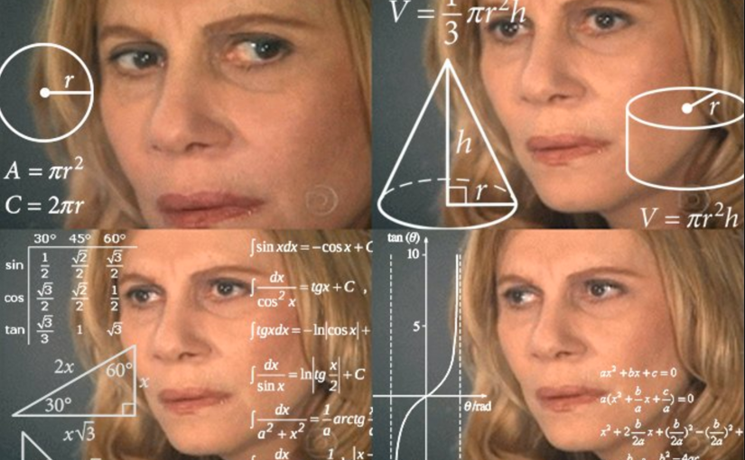

## Procedural Skybox

## Sun


## 云

画云的方法一个是通过采样一张噪音[贴图](https://timcoster.files.wordpress.com/2019/09/cloudstileable1_maintex.png)直接画在天空盒上，另一个是gpu instance制作体积云。

```

```


> 
>
> 
>
> 物理天空：
>
> 
>
> 
>
> 
>
> 
>
> 数学库文档：
>
> https://developer.download.nvidia.cn/cg/abs.html
